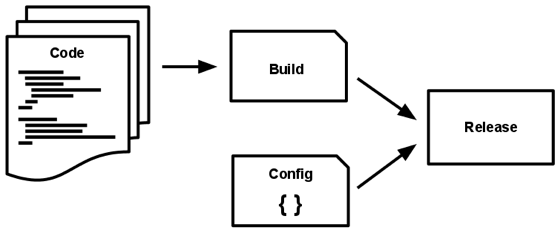

!SLIDE center
# Twelve Factor Ruby

!SLIDE center

## www.12factor.net
## Adam Wiggins

!SLIDE center
# I. Codebase
## One codebase tracked in revision control, many deploys

!SLIDE commandline
# II. Dependencies
## Explicitly declare and isolate dependencies

    $ bundle install
    $ bundle exec

!SLIDE
# III. Config
## Store config in the environment

    @@@ Ruby
    Sequel.connect ENV['DATABASE_URL']

    ActiveRecord.establish_connection 
    ActiveRecord.establish_connection(url) 

`https://github.com/glenngillen/activerecord_url_connections `

!SLIDE center
# IV. Backing Services
## Treat backing services as attached resources

!SLIDE center
# V. Build, release, run
## Strictly separate build and run stages

!SLIDE commandline
# VI. Processes
## Execute the app as one or more stateless processes

    $ bundle exec thin start

    $ bundle exec rake work

!SLIDE
# VII. Port binding
## Export services via port binding

    $ bundle exec thin start -p $PORT

!SLIDE center
# VIII. Concurrency
## Scale out via the process model

!SLIDE
# IX. Disposability  

    @@@ Ruby
    trap('SIGTERM') do
      gracefully_shutdown
    end

!SLIDE center
# X. Dev/prod parity

!SLIDE
# XI. Logs
## Treat logs as event streams

    @@@ Ruby
    config.logger = Logger.new(STDOUT)
  

!SLIDE
# XII. Admin Processes
## Run admin/management tasks as one-off processes

    $ bundle exec rake db:migrate

!SLIDE
# (13) Tests 
## Write tests to verify your logic

!SLIDE bullets incremental
# Rails Fails: 
  - III. Config 
  - XI.  Logs

!SLIDE
# III. Config
  
    - conforms with (I)
    - config/database.yml
    - config/environments

!SLIDE commandline
# XI. Logs

    $ tail -f log/development.log

!SLIDE
# Both Fails are EASILY overcome

!SLIDE
# Ruby Frameworks are For The Win!
